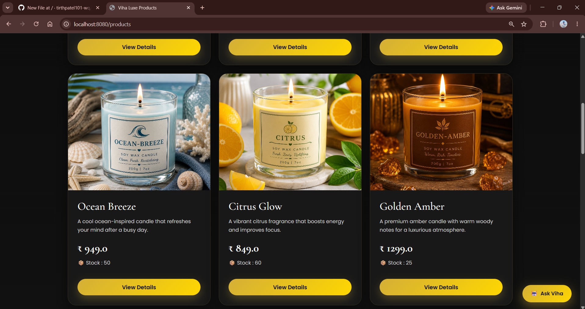
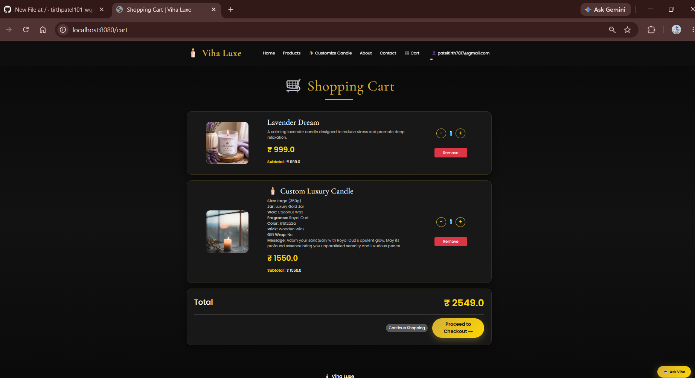
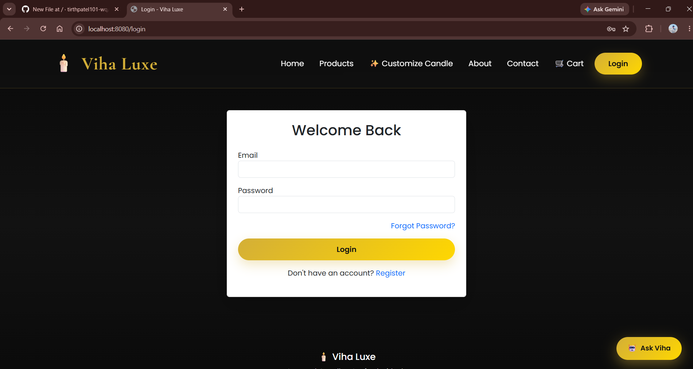
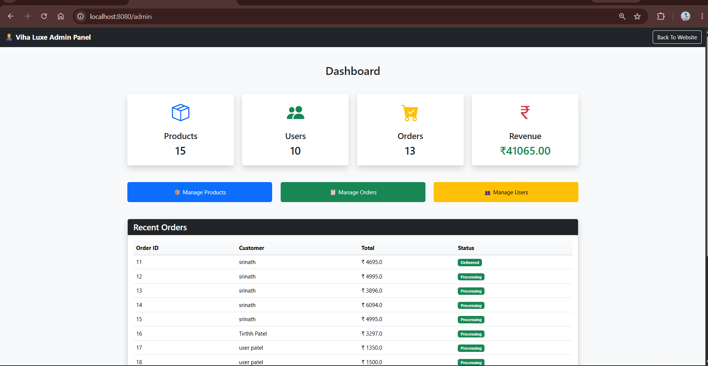
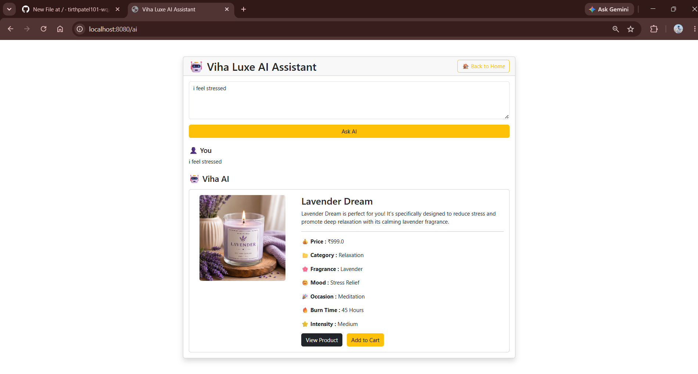
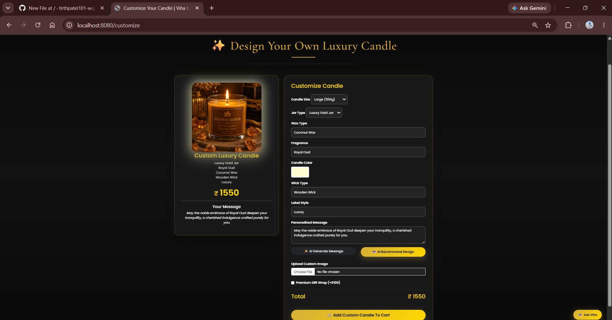

# 🕯️ VihaLuxe

## AI-Powered Luxury Candle E-Commerce Platform

VihaLuxe is a full-stack e-commerce web application for luxury scented candles. The platform allows users to explore products, search for candles, receive AI-powered recommendations, create custom candles, manage their cart, place orders, and manage their account.

The application also includes an admin dashboard for managing products, users, and customer orders.

---

## ✨ Features

### 👤 User Features

- User Registration and Login
- Secure Authentication using Spring Security
- Browse Luxury Candle Products
- Search Products by Name
- View Product Details
- Add Products to Cart
- Update and Remove Cart Items
- Checkout and Place Orders
- View Order History
- User Profile Management
- Forgot Password and Password Reset
- Email Functionality
- AI-Powered Candle Recommendations
- Custom Candle Creation

### 🤖 AI-Powered Recommendations

Users can receive personalized candle recommendations based on their preferences.

The AI recommendation feature uses the **Gemini API** to suggest suitable candles based on factors such as:

- Fragrance Preferences
- Mood
- Occasion
- Candle Intensity

### 🕯️ Custom Candle Feature

Users can create personalized candles by selecting their preferred candle options and customization details.

Custom candle designs are handled separately from the main product catalog.

### 👨‍💼 Admin Features

- Admin Dashboard
- Manage Products
- Add New Products
- Edit Products
- Delete Products
- View Registered Users
- Manage Customer Orders

---

## 🛠️ Tech Stack

### Backend

- Java 21
- Spring Boot
- Spring MVC
- Spring Data JPA
- Spring Security
- Maven

### Frontend

- HTML5
- CSS3
- JavaScript
- Bootstrap 5
- Thymeleaf

### Database

- PostgreSQL

### Integrations

- Google Gemini API
- Gmail SMTP

---

## 📸 Screenshots

### Project Screenshots

#### Home Page


#### Products



#### Shopping Cart


#### Login


#### Admin Dashboard


#### AI Assistant


#### Customize Candle



---

## 📂 Project Structure

```text
vihaluxe/
│
├── src/
│   ├── main/
│   │   ├── java/com/vihaluxe/
│   │   │   ├── controller/
│   │   │   ├── service/
│   │   │   ├── repository/
│   │   │   ├── model/
│   │   │   ├── dto/
│   │   │   ├── config/
│   │   │   ├── security/
│   │   │   └── ai/
│   │   │
│   │   └── resources/
│   │       ├── static/
│   │       ├── templates/
│   │       └── application.properties
│   │
├── screenshots/
├── pom.xml
├── system.properties
└── README.md
```

---

## ⚙️ Run Locally

### 1. Clone the Repository

```bash
git clone YOUR_GITHUB_REPOSITORY_URL
```

### 2. Navigate to the Project

```bash
cd vihaluxe
```

### 3. Configure Environment Variables

Configure the following environment variables:

```text
DATABASE_URL
DATABASE_USERNAME
DATABASE_PASSWORD
GEMINI_API_KEY
MAIL_USERNAME
MAIL_PASSWORD
```

### 4. Create PostgreSQL Database

Create a database named:

```text
vihaluxe
```

### 5. Run the Application

On Windows:

```bash
mvnw.cmd spring-boot:run
```

Or using Maven:

```bash
mvn spring-boot:run
```

### 6. Open in Browser

```text
http://localhost:8080
```

---

## 🔐 Environment Variables

The project keeps sensitive credentials outside the source code.

Example configuration:

```properties
spring.datasource.url=${DATABASE_URL}
spring.datasource.username=${DATABASE_USERNAME}
spring.datasource.password=${DATABASE_PASSWORD}

gemini.api.key=${GEMINI_API_KEY}

spring.mail.username=${MAIL_USERNAME}
spring.mail.password=${MAIL_PASSWORD}
```

---

## 🚀 Key Highlights

- Full-Stack Java Web Application
- Secure Authentication and Authorization
- Role-Based Admin Access
- AI Integration with Gemini API
- Custom Product Creation
- E-Commerce Cart and Order Management
- PostgreSQL Database Integration
- Responsive User Interface

---

## 👨‍💻 Developer

**Tirth Patel**

GitHub: Add your GitHub profile link here

---

⭐ If you like this project, consider giving it a star!
